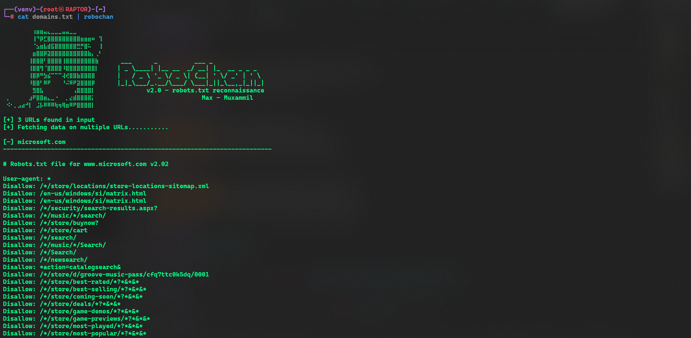

# RoboChan 🤖

A fast and efficient robots.txt reconnaissance tool for security researchers and penetration testers. RoboChan fetches robots.txt files from web servers and generates comprehensive URL lists for further security analysis.

```
⠀⠀⠀⠀⠀⠀⠀⠀⢰⣶⣶⣤⣄⣀⣀⣀⣤⣤⣀⣀⠀
⠀⠀⠀⠀⠀⠀⠀⠀⢸⠙⡿⣋⣿⣿⣿⣿⣿⣿⣿⣿⣿⣶⣶⣶⠶⠀⢹
⠀⠀⠀⠀⠀⠀⠀⠀⠈⣢⣶⣧⣾⣯⣿⣿⣿⣿⣿⣿⣛⡛⣿⠥⠀⠀⢸
⠀⠀⠀⠀⠀⠀⠀⠀⣶⣿⣿⡿⣽⣿⣿⣿⣿⣿⣿⣿⣿⣿⣿⣷⡄⢀⠃
⠀⠀⠀⠀⠀⠀⠀⢸⣿⣿⣿⠃⣿⣿⣿⣿⢸⣿⣿⣿⣿⣿⣿⣿⣿⣷      ___      _         ___ _              
⠀⠀⠀⠀⠀⠀⠀⢸⣿⣿⢻⠈⣿⣿⣿⣿⠸⣿⣿⣿⣿⣿⣿⣿⣿⡇     | _ \____| |__  ___/ __| |_   __ _ _ _  
⠀⠀⠀⠀⠀⠀⠀⢸⣿⡿⠛⣳⣮⠉⠉⠉⢼⢞⣿⣿⣷⣿⣿⣿⣿      |   / _ \ '_ \/ _ \| (__| ' \/ _' | ' \ 
⠀⠀⠀⠀⠀⠀⠀⠸⣿⣿⠃⠿⠟⠀⠀⠀⠘⠬⠿⠟⣽⣿⣿⣿⡿      |_|_\___/_.__/\___/ \___|_||_\__,_|_||_|
⠀⠀⠀⠀⠀⠀⠀⠀⣻⣿⣧⠀⠀⠀⠀⠀⠀⠀⠀⢠⣿⣿⣿⣿⡇              v2.0 - robots.txt reconnaissance
⠀⡀⠀⠀⠀⠀⠀⣰⠟⣿⣿⣶⣄⣀⠐⠀⠀⡀⣔⣾⣿⣿⣿⣿⡅			      Max - Muxammil
⠀⠪⠂⡀⣠⣴⠚⡇⠀⣨⡧⠿⠿⠿⢷⢶⢿⣶⠿⠟⣿⣿⣿⣿⡇
```

## 🚀 Features:

- **Fast & Lightweight**: Written in Go for optimal performance
- **Bulk Processing**: Process multiple domains from stdin or file
- **URL Generation**: Automatically generate full URLs from robots.txt paths
- **Multiple Output Formats**: Support for TXT and JSON output
- **WAF Bypass**: Enhanced headers to bypass common web application firewalls
- **Gzip Support**: Automatic decompression of gzipped responses
- **Error Handling**: Graceful handling of timeouts, redirects, and HTTP errors

## 📦 Installation:

### Option 1: Go Install (Recommended)
```bash
go install github.com/maxmuxammil/RoboChan@latest
```

### Option 2: Download Binary
```bash
# Download from releases page
wget https://github.com/maxmuxammil/RoboChan/releases/download/robochan/robochan-linux-amd64
chmod +x robochan-linux-amd64
sudo mv robochan-linux-amd64 /usr/local/bin/robochan
```

### Option 3: Build from Source
```bash
git clone https://github.com/maxmuxammil/RoboChan.git
cd RoboChan
go build -o robochan robochan.go
```

## 🛠️ Usage:

### Basic Usage

```bash
# Single domain
echo "tesla.com" | robochan

# Multiple domains from file
cat domains.txt | robochan

# With URL generation
echo "facebook.com" | robochan -g

# Save output to file
cat domains.txt | robochan -g -o results.txt
```

### Command Line Options

```bash
Usage of robochan:
  -g    Generate full URLs from robots.txt paths
  -o string
        Output file for generated links (e.g., output.txt or output.json)
```

### Examples

**Basic reconnaissance:**
```bash
echo "example.com" | robochan
```

**Generate URLs and save to JSON:**
```bash
echo "target.com" | robochan -g -o results.json
```

**Bulk processing with URL generation:**
```bash
cat domains.txt | robochan -g -o discovered-urls.txt
```

**Use with other tools:**
```bash
# Pipe to httpx for live URL detection
cat domains.txt | robochan -g | httpx -silent -sc

# Combine with subfinder
subfinder -d example.com -silent | robochan -g (sometimes it doesn't parse correctly)
```

## 📋 Input Format:

RoboChan accepts domains in the following formats:
- `example.com` (automatically adds https://)
- `https://example.com`
- `http://example.com`

Create a domains.txt file:
```
tesla.com
facebook.com
microsoft.com
```

## 📤 Output Formats:

### Text Output (-o results.txt)
```
# tesla.com
# Robots.txt: https://tesla.com/robots.txt
#------------------------------------------------------------
https://tesla.com/admin/
https://tesla.com/api/
https://tesla.com/private/
```

### JSON Output (-o results.json)
```json
[
  {
    "url": "tesla.com",
    "robots_url": "https://tesla.com/robots.txt",
    "content": "User-agent: *\nDisallow: /admin/",
    "generated_urls": [
      "https://tesla.com/admin/"
    ]
  }
]
```

## 🔧 Advanced Usage:

### Integration with Bug Bounty Workflows

```bash
# Step 1: Subdomain enumeration
subfinder -d target.com -silent > subdomains.txt

# Step 2: Robots.txt reconnaissance
cat subdomains.txt | robochan -g -o robots-urls.txt

# Step 3: HTTP probe discovered URLs
cat robots-urls.txt | httpx -silent -mc 200,301,302,403

# Step 4: Directory bruteforcing on interesting paths
cat robots-urls.txt | grep -E "(admin|api|private)" | dirsearch -l /dev/stdin
```

### Filtering Interesting Paths

```bash
# Extract admin/sensitive paths
cat domains.txt | robochan -g | grep -E "(admin|api|dashboard|private|internal|dev|test|staging)"

# Find file extensions
cat domains.txt | robochan -g | grep -E "\.(php|asp|jsp|do|action|cfm)$"

# Backup and config files
cat domains.txt | robochan -g | grep -E "(\.bak|\.old|config|\.env|\.git)"
```

## ⚡ Performance:

- **Concurrent Processing**: Processes multiple domains simultaneously
- **Timeout Handling**: 10-second timeout per request with redirect limits
- **Memory Efficient**: Streams input and processes on-the-fly
- **Rate Limiting**: Built-in crawl-delay respect

## 🛡️ Security Features:

- **WAF Bypass**: Uses realistic browser headers
- **User-Agent Rotation**: Mimics legitimate browser traffic  
- **Gzip Handling**: Automatic decompression of responses
- **Error Recovery**: Graceful handling of blocked requests
- **Redirect Following**: Automatic redirect handling with limits

## 📊 Use Cases:

- **Bug Bounty Hunting**: Discover hidden endpoints and admin panels
- **Penetration Testing**: Enumerate web application structure
- **Red Team Operations**: Reconnaissance and attack surface mapping
- **Security Research**: Analyze robots.txt implementation patterns
- **Web Scraping**: Respect robots.txt while gathering intelligence

## 🥃 Screenshot:



## 🐛 Bug Reports:

Report bugs and request features via [GitHub Issues](https://github.com/maxmuxammil/RoboChan/issues).

## 📝 License:

This project is licensed under the MIT License - see the [LICENSE](LICENSE) file for details.

## ⚠️ Disclaimer:

This tool is for educational and authorized security testing purposes only. Users are responsible for compliance with applicable laws and regulations. The author is not responsible for misuse of this tool.

## 🔗 Related Tools:

- [httpx](https://github.com/projectdiscovery/httpx) - Fast HTTP probe
- [subfinder](https://github.com/projectdiscovery/subfinder) - Subdomain discovery  
- [dirsearch](https://github.com/maurosoria/dirsearch) - Directory bruteforcing
- [waybackurls](https://github.com/tomnomnom/waybackurls) - Wayback machine URLs

---


**Created with ❤️ by [Max-Muxammil](https://github.com/maxmuxammil)**
